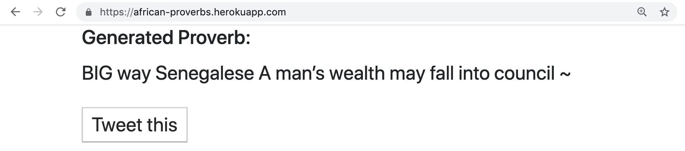

## African Proverbs Tweet Generator
Make School CS 1.2: How Data Structures Work

## Project Sprints
* Project goals:
    + [ ] Use a Python script to randomly generate words from a dictionary.
    + [ ] Build sentences by sampling these words using a Markov language model.
    + [ ] Implement grammar rules parsed from the text of a large document set.
    + [ ] Build data structures including linked lists, hash tables, stacks, queues, and heaps to store the words and sentences.
    + [ ] Analyze the inner workings and performance tradeoffs of each data structure.
    + [ ] Deploy your language model to a Flask web server on Heroku and connect it to Twitter to let users tweet their favorite results.

* Learning outcomes:
    + [ ] Master Python data structures and data processing algorithms
    + [ ] Implement data structures including linked lists, hash tables, stacks, queues and heaps.
    + [ ] Parse text documents and store information in data structures
    + [ ] Implement sampling methods and Markov chains on data sets

© Copyright 2019 Fodé Diop - MIT License